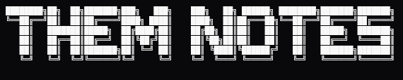
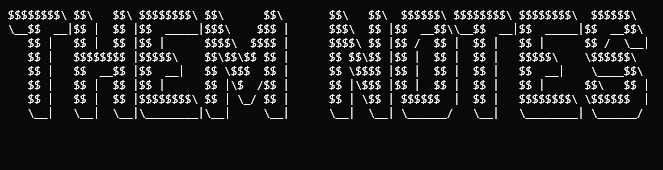
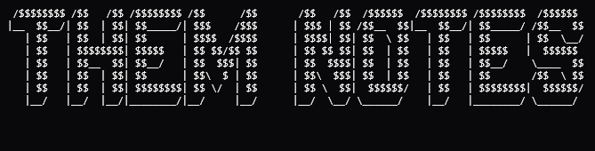

  
  
  
  
  
  
  
  
  
  
  
  

Repo contains all my md files for everything I'm learning or planning on learning.
Documents are numbered and related files are linked.
Use Obsidian for easy viewing.